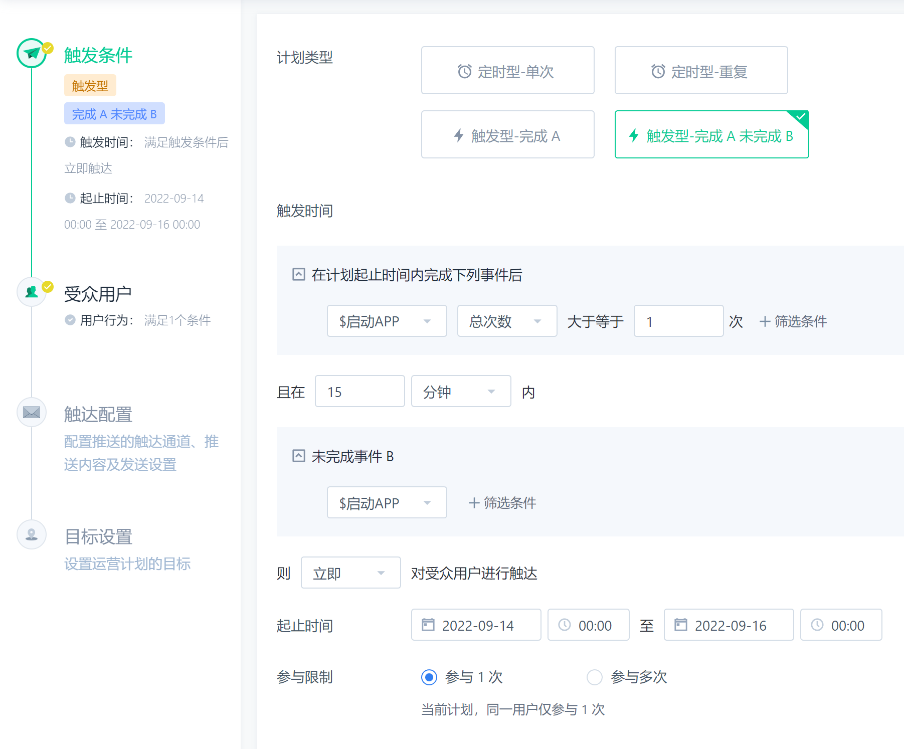
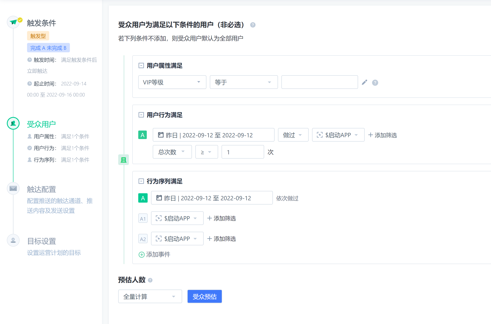
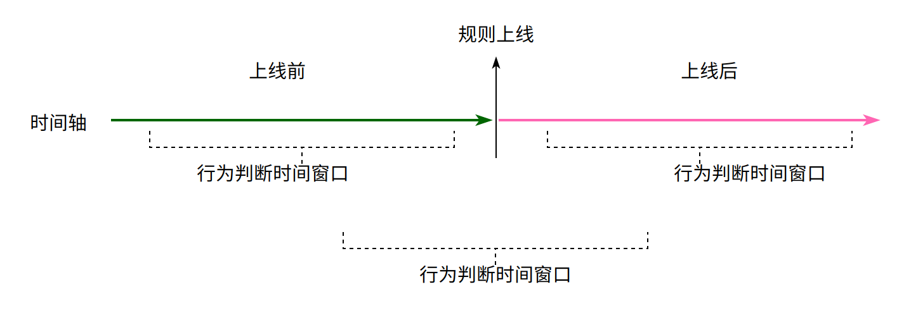
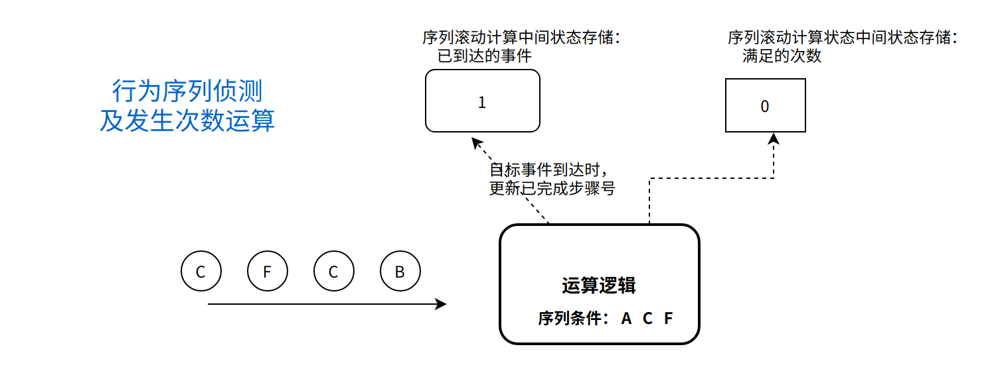
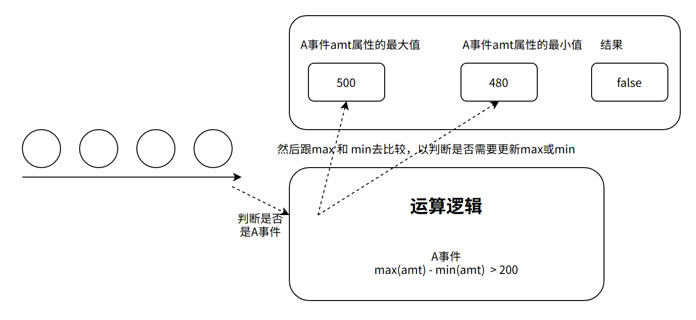
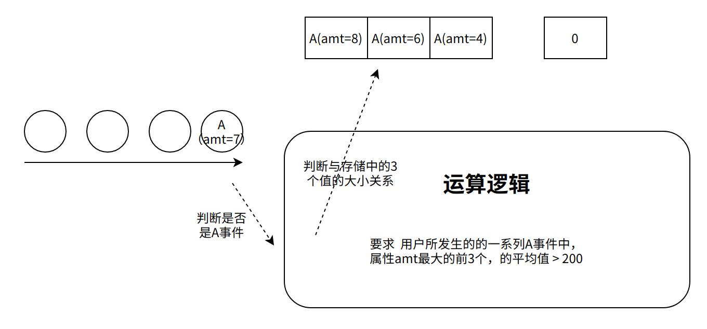
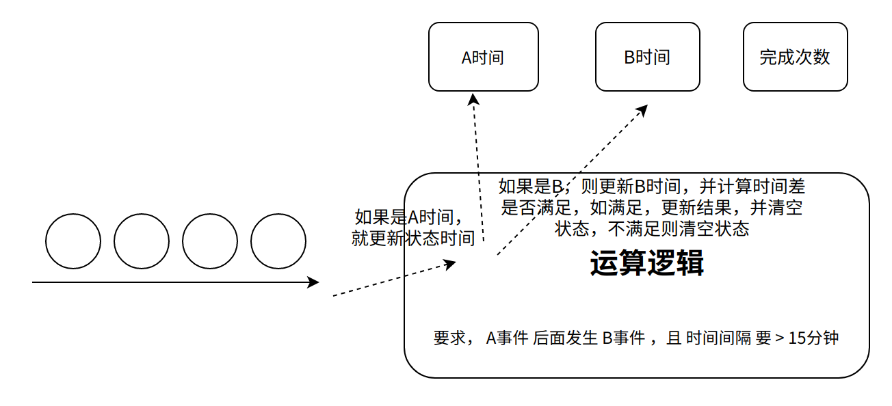

# 实时智能营销推送系统

## 项目概述
本project包含两个模块：
- 实时智能营销推送系统的后端规则引擎
- 管理监控平台 

规则引擎主要开发技术：
 - flink 
 - kafka
 - redis
 - clickhouse
 - hbase
 - drools

管理监控平台主要开发技术：
- springboot
- mybatis
- react-js


## 系统启动环境准备

- 启动kafka
- 启动redis
- 启动hbase
- 启动clickhouse
- 启动用户行为数据模拟器
- 启动canal

## 系统启动步骤
- 启动manageplatform管理平台web系统
- 启动dynamic_rule_engine实时flink动态规则引擎

## 埋点方案(参考)
https://www.yuque.com/chengxingyuan/gvz0mp/ltkeod#hpfo5

## 总体设计

- 
- 

##  设计目标

本项目也可以用于实时规则风控、实时规则推荐等场景

**1 项目背景**

传统的"精准营销平台"由营销人员基于画像标签数据去圈选人群，进行营销推送，存在不足；
这种传统手段，往往无法抓住那些 "转瞬即逝的营销机会"；

如：一个促销狂热型用户，正在浏览包包时，及时推送出正在做促销活动的包包信息，是最有效的； 
如：一个价格敏感型用户，正在犹豫不决反复查看他购物车中的某目标商品时，适时推送优惠券，是最有效的；  

这些场景，显然无法通过营销人员通过人工手段去发现，需要用软件系统**自动、实时监控用户的行为**，并**实时做出判断，**并进而驱动营销消息推送系统推送相关营销内容；

总之，在应对这一类的需求时，以前的传统的"基于用户画像标签库的精准营销平台"显得力不从心；

决定为公司的推广、运营部门开发一个应对上述场景的自动化、智能的、实时、规则动态可变的营销利器
------ 《实时**动态规则**智能运营系统》






**2 需求分析**

**2.1 营销规则举例**

- 搜索兴趣词包含"商务休闲"的用户，如果浏览包含"商务休闲"的商品页面，则触发一个优惠券推送消息；

- 活跃度等级为C的用户，且在规则发布前的3天内，发生过 "搜索雀巢" AND "加购"
，当他再次上线时，触发一个app弹窗消息；

- 活跃度等级为C的用户，规则发布前2天内，发生过A事件3次以上，规则上线后发生了B事件，且之后间隔1天再次发生B事件，则触发；

- 规则运行时，检测到用户发生了下单事件，而在随后的15分钟内没有支付，则触发；

- 规则运行时，一个用户如果搜索的关键词符合某正则表达式，则触发；

    宝妈用户，在2022-08-07开始，做过A行为3+次，做过（B行为，E行为）序列2+次，则触发；

**2.2 规则营销需求的宏观抽象**

    营销规则有多样化的灵活的定义（不光参数可以支持自定义，且运算模型也可以自定义）；

    营销规则通常针对满足某画像的人群，也可没有针对性

    营销规则通常都有有效期（也有可能是无限期的），要求系统能够支持动态增加、停用运营计划（规则）

    营销规则根据需求的变化，需要能够方便地进行在线管理，如新增、停用、修改

**2.3 营销规则受众条件的逻辑要素抽象分析**

各类营销规则，都支持对目标人群的圈选

- 圈选的手段之一是：是对用户的画像标签数据进行定义、判断**

- 圈选的手段之二是：对用户的行为数据进行自定义即时计算（广义上就是实时用户画像）**

而行为数据即时计算的时间跨度，通常是有**时间窗口约束**的，而所涉及的时间跨度可能有：

    - 只包含规则上线之前

    - 只包含规则上线之后

    - 横跨规则上线前到上线后



**受众圈选行为画像即时条件中，抽象出来的判断要素主要有**

**事件类型及属性**是否满足规则（如搜索事件且搜索词是否满足正则、是否包含指定关键字等）

**事件序列**是否满足规则（是否依次发生过A-C-E序列）

事件或事件序列的**发生次数**是否满足（如X事件是否发生了N次）

事件的**属性统计值**是否满足（如X事件中的sum(属性amt) \> 100
，事件X的行为总时长\>20）

事件与事件之间的**对比关系**，如时间间隔（如：A-B事件的间隔\>N）、属性值（统计）对比

**最后，就是上述各类条件的逻辑组合： 与 、或 、 非、 大于、 小于、
等于......**

    - 条件1： A发生次数 >3

    - 条件2 ： A事件的max(amt) - A事件的min(amt） > 200

    - 条件3 ： A - B间隔> 5min

最终规则： 条件1 与 （条件2 或 条件3）

**思考**：                                                          
- A事件中pageid="p05" 的次数,以及A事件中pageid="p10"的次数，是否包含在上述要素中？                                             
- A事件中，MAX(属性amt) > 2* MIN(属性amt), 是否包含在上述要素模型中？                                           |
- 各次A事件 中 amt 属性的 最大的前3个值 ，的平均值 \>10 ？            

## 概要设计##

**3.1 各类受众条件运算的实现逻辑初步设计（实时画像计算条件）**

**3.1.1 画像条件的逻辑分析**

    一个查询画像标签库进行判断的动作

**3.1.2 行为判断的逻辑分析**

**1）行为判断：行为事件的类型及属性的判断**

- 判断用户的某个行为事件，是否是规则条件中要求的事件
简单的，可能就是

```
event_id = "X" AND properties["p1"] !="v1"
```

稍微复杂的 ，可能就是
```
event_id = "X" AND properties["p1"] 包含 "kw1"
```
再复杂点的，可能就是

```
event_id = "X" AND properties["p1"] + properties["p2"] > 100 AND properties["p3"\] 
满足 正则表达式 [1,10]*?a
```

**2）行为序列的判断**

```
判断用户的一系列行为事件中，是否满足规则条件所要求的依次发生的序列，比如A B
E

行为序列判断，是上述 "行为判断" 的衍生

本质上，就是在 判断事件 的基础上，加上时间先后的序列关系

这个逻辑，可以用 正则匹配进行计算（全窗口运算）, 也可以用滚动聚合的方式计算；
```
**3）事件（序列）发生次数的判断**

```
判断要求的事件或事件序列，发生了多少次

是上述 "行为判断"、"行为序列判断" 的衍生

本质上，就是在 判断事件（或序列）的基础上，进行次数累计
```

**4）事件属性值统计条件运算**

也好说，主要是对满足条件的事件，为目标属性值进行累加等运算

比如:要求 用户所发生的的一系列A事件中，属性amt最大值 - 最小值 >100



比如: 要求 用户所发生的的一系列A事件中，属性amt最大的前3个，的平均值 > 200



**5）事件与事件对比关系的判断**

事件对比关系的判断，也是上述"行为判断"的衍生

如事件间隔时长的判断，本质上，也是在 判断事件的基础上，进行时间差的运算

比如，要求， A事件 后面发生 B事件 ，且 时间间隔 要 \> 15分钟



结论：不管用户的规则如何变化，如何灵活多样，只要设计好合理的运算逻辑+合理的中间聚合结果数据结构，我们都可以用持续、滚动运算的方式来实现！**


**3.2 受众条件运算实现逻辑深入设计**

**3.2.1 静态画像条件的逻辑实现**

**1）画像条件判断的实现难点**

初略考虑，应该就是查询用户画像标签库即可；

站在系统的角度来考虑时： 什么时机去查询？ 去哪里查？

比如：

查询时机：                                                            
-  当一个人的某个行为触发了某个规则，此时去查询该用户的画像标签是否满足规则的人群画像条件  
查询的目标： 用户画像标签数据库                                       



如果画像数据库在hbase中，可以用如下伪代码来快速判断

如果条件是： 活跃等级 = C AND 首单时间< "2022-06-01
```
get = new Get(guid)
get.addColumn("活跃等级")
get.addColumn("首单时间")

result = table.get(Get)

activeLevel = result.getValue("活跃等级")
firstOrderDate = result.getValue("首单时间")

if(activeLevel = 'C' && firstOrderDate< "2022-06-01")
return true;
```

如果条件是： 兴趣词 ：包含 "速溶咖啡"
这种条件，用hbase的支撑就不太好处理了
```
favroitWords : [海底捞, 咖啡伴侣, 小罐速溶咖啡，乔丹 ，篮球 ]
favroitWords = result.getValue("兴趣词")
```

### 性能考量
会新开一篇掘金博客讲解

### 画像设计 

会新开一篇掘金博客讲解


